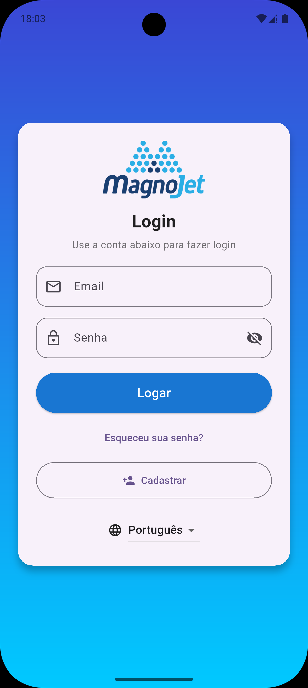
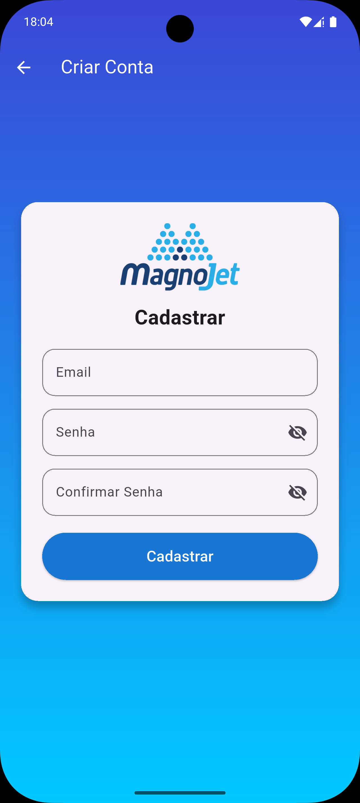
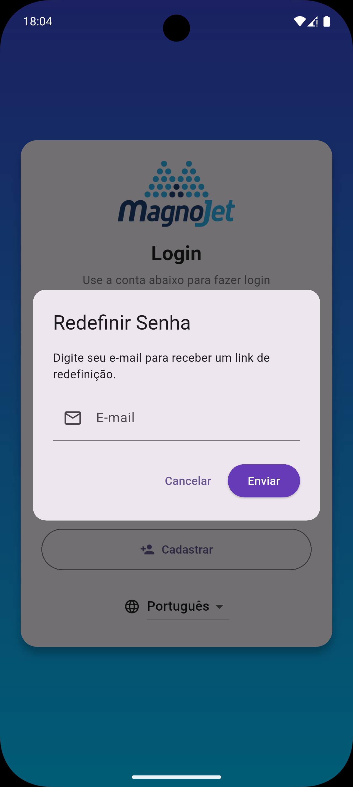
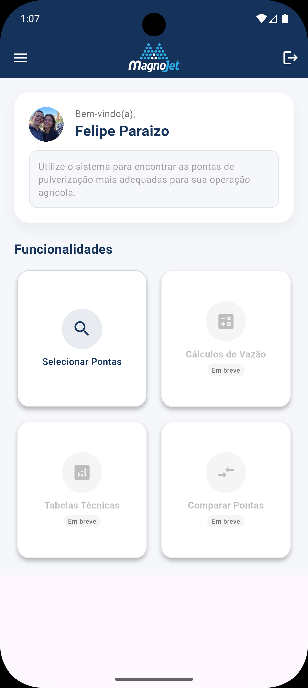
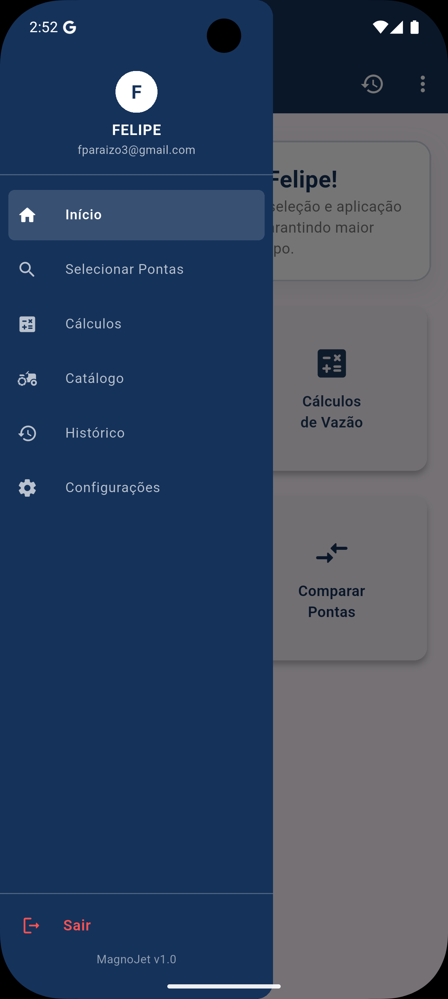
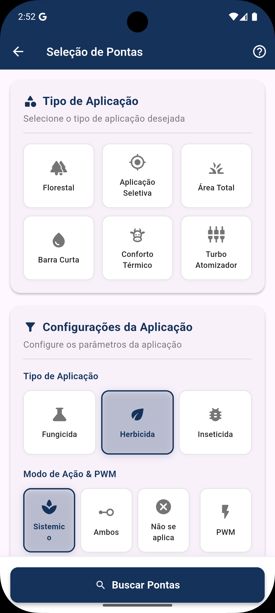

  

<h1 align="center">
  <strong>Aplicativo MagnoJet</strong>
</h1>

  Bem-vindo(a) ao <strong>Aplicativo MagnoJet</strong> 🚀 
  Este aplicativo foi desenvolvido para a <strong>empresa MagnoJet</strong>, com o objetivo de auxiliar <strong>clientes e consultores</strong> na <strong>seleção das melhores pontas de pulverização</strong> disponíveis no mercado.

  <a href="/README.md" target="_blank">🇺🇸 English</a>
  &nbsp;&nbsp;&nbsp;|&nbsp;&nbsp;&nbsp;
  <a href="https://github.com/Fparaiz0/app_magnojet/issues" target="_blank">🐛 Reportar Bug</a>
  &nbsp;&nbsp;&nbsp;|&nbsp;&nbsp;&nbsp;
  <a href="https://github.com/Fparaiz0" target="_blank">💼 Perfil GitHub</a>

---

# 📱 Funcionalidades

- 🔎 **Seleção Inteligente:** Encontre as pontas de pulverização ideais para suas necessidades.
- 📊 **Informações Técnicas:** Acesse dados detalhados e especificações de cada produto.
- 🔒 **Autenticação Segura:** Sistema de login e cadastro de usuários com PostgreSQL.
- ☁️ **Sincronização Automática:** Funcionalidade offline-first com SQLite, garantindo uso contínuo e sincronização automática com a nuvem.
- 🌍 **Multiplataforma:** Suporte nativo para Android & iOS a partir de uma única base de código.

---

# 🎨 Telas do Aplicativo

  

    
    
    
  

  

    
    
    
  

---

# 🛠️ Tecnologias Utilizadas

  
  
  
  
  
  
  
  

---

# 👨‍💻 Autor

Este projeto foi desenvolvido por **Felipe Paraizo**.

O código-fonte está hospedado neste repositório: [github.com/Fparaiz0/app_magnojet](https://github.com/Fparaiz0/app_magnojet)
