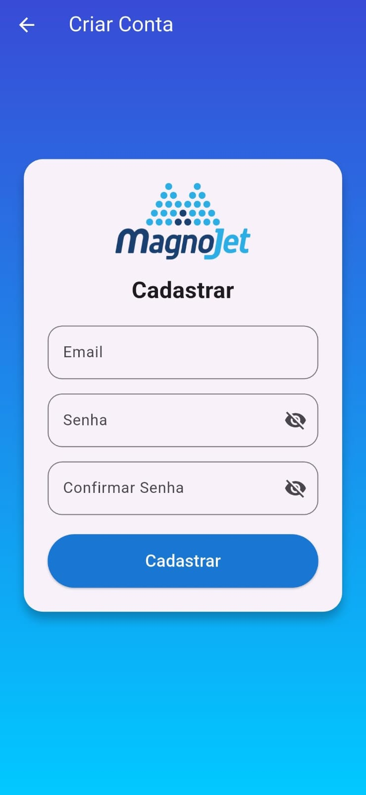

# 🌱 Aplicativo de Seleção de Pontas - MagnoJet

Bem-vindo(a ) ao **MagnoJet App** 🚀  
Este aplicativo foi desenvolvido para a **empresa MagnoJet**, com o objetivo de auxiliar **clientes e consultores** na **seleção das melhores pontas de pulverização** disponíveis no mercado.

---

## 📱 Funcionalidades

-   🔎 **Seleção Inteligente:** Encontre as pontas de pulverização ideais para suas necessidades.
-   📊 **Informações Técnicas:** Acesse dados detalhados e especificações de cada produto.
-   🔒 **Autenticação Segura:** Sistema de login e cadastro de usuários com Firebase.
-   ☁️ **Sincronização Automática:** Funcionalidade offline-first com SQLite, garantindo uso contínuo e sincronização automática com a nuvem.
-   🌍 **Multiplataforma:** Suporte nativo para Android & iOS a partir de uma única base de código.

---

## 🎨 Telas do Aplicativo

  
  
  

---

## 🛠️ Tecnologias Utilizadas

  
  
  
  
  
  
  

---

## 👨‍💻 Autor

Este projeto foi desenvolvido por **Felipe Paraizo**.

O código-fonte está hospedado neste repositório: [github.com/Fparaiz0/app_magnojet](https://github.com/Fparaiz0/app_magnojet )
